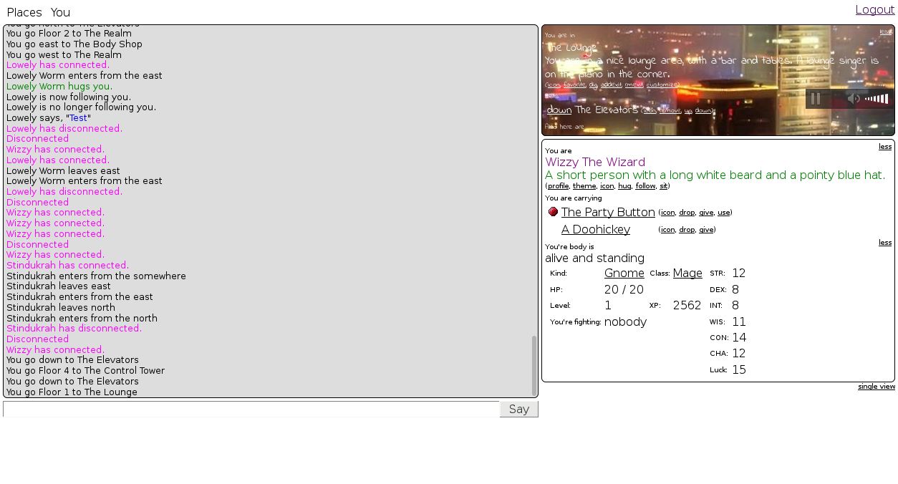
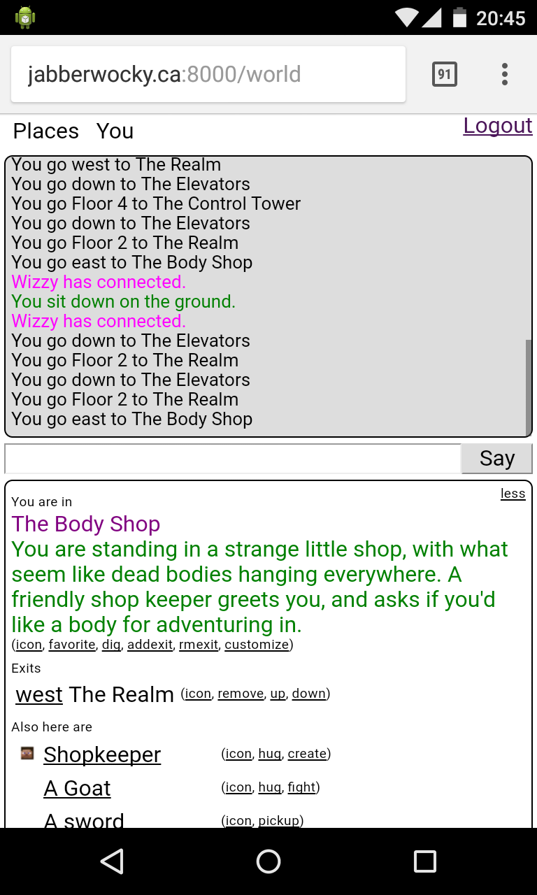

WebMUSH
=======

###### *Started February 16, 2017*

A web-based MUSH (Multi-User Shared Hallucination) server, in the spirit of the MUDs, MUSHes, and MOOs of the 80's and
90's. It is written is Node.js with Express for the backend, Mithril + Webpack for the frontend, and websockets for
communicating between them. The world can be navagated using hyperlinks, or by typing eg. "/go north". The engine can
be used either for social or game-playing purposes. 

Configuration
-------------

The following environment variables are recognized:

* PORT      The port number the server should run on.  Default: 3000

* DATA_DIR  The directory where data is stored (the object db and uploaded media).  It should match the layout of the data
            directory in the repository.  Default: <repo>/data

Running
-------

The client code must be compiled with webpack before starting the server
```sh
npm install
npm run build
```

Or nodemon can be used to recompile the client code and restart the server whenever a code change is made using
```sh
npm install -g nodemon
npm run nodemon
```
 
The server can be started manually without automatic restarting using
```sh
npm start
```

Screenshots
-----------




